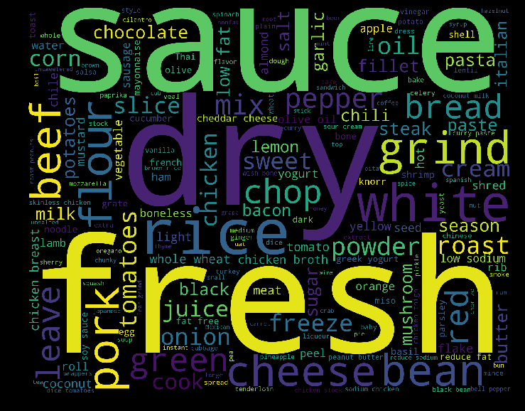

lift up the app by command: python -m http.server

# RecipeProject
Exploring recipe datas using machine learning algorithms, and visualizingthe findings using d3 technology

**Basic functionality:**
  Developing index.html,main.js, style.css

**Expected functionality:**
  Developing distinctive.html, distinctive.js,distinctive.css

**Bounus functionality:**
  Developing similarity.html, similarity.js,similarity.css

**CSS Folder:** for all css file,include related libs

**js Folder:** for all js file, include related libs

**Data Folder:** for all csv, python file

**Func1 draft**

