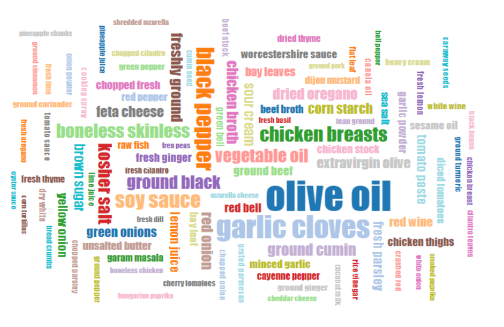
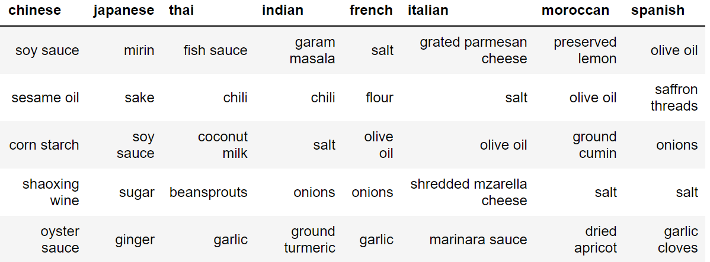
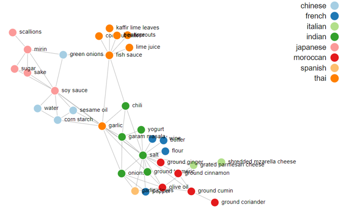
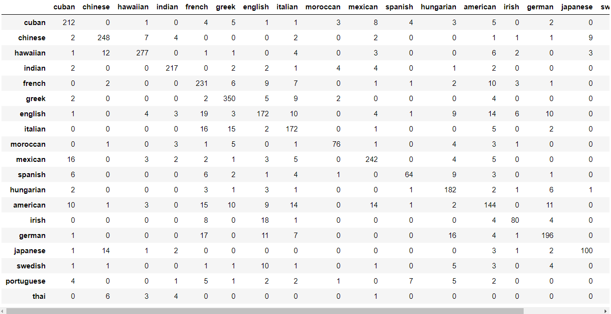
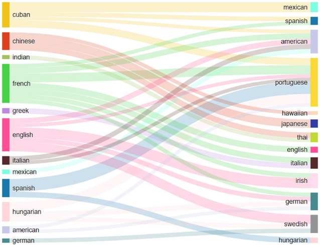

lift up the app by command: python -m http.server

# RecipeProject
## Exploring recipe datas using machine learning algorithms, and visualizingthe findings using **d3 technology**

## The dataset was made of nearly 7000 recipes which had around 4000 plus ingredients and 19 cuisines. 

### This project tries to find the similarities between dishes and cuisines using the given dataset and we will plot various diagrams to showcase the similarities. Thus, we have
### extracted three problems based upon the dataset which are:

#### 1. What are the popular and common ingredients used in the world?
#### 2. Which ingredient can represent its flavor or cuisine?
#### 3. How much relation is there between each cuisine?

### 1. What are the popular and common ingredients used in the world?
Create a word cloud which include top 100 highest frequency ingredients from our recipe dataset. The task which include two parts. First part is data preprocessing which extracts all categories of ingredient from the recipe dataset and then calculates the frequency of all ingredients. Second part is data visualization which present top 100 ingredients by using word cloud. The font size of ingredients increases along with the frequency of ingredients.

### 2. Which ingredient can represent its flavor or cuisine?
Find out the distinctive ingredients for cuisines which can represent them respectively, and the pairwise combinations of these ingredients for each cuisine. And visualize these findings using node-link graph.

Tf-idf can reflect how important a word is to a document. Based on this idea, we used it to extract how important an ingredient to a cuisine. And ranked the top 5 important ingredients as the distinctive ingredients for each cuisine. The result of distinctive ingredients shows in Figure 10 below.

We chose node-link graph for the visualization of this functionality. The nodes represent the distinctive ingredients, and the links represent the pairwise combinations of the distinctive ingredients in each cuisine. 

#### 3. How much relation is there between each cuisine?
Calculate similarities between each cuisine.
Split the data recipe data into training set and testing set, made the cuisine feature as target label, used Logistic Regression to predict the target label for the testing set, and evaluate the model using confusion matrix, showed at Figure 13 below:

Calculated the confusion rates for each cuisine, bigger confusion rate implies bigger similarity level. For example,if Chinese has bigger confusion rate with Japanese, that means they are more similar

**CSS Folder:** for all css file,include related libs

**js Folder:** for all js file, include related libs

**Data Folder:** for all csv, python file
